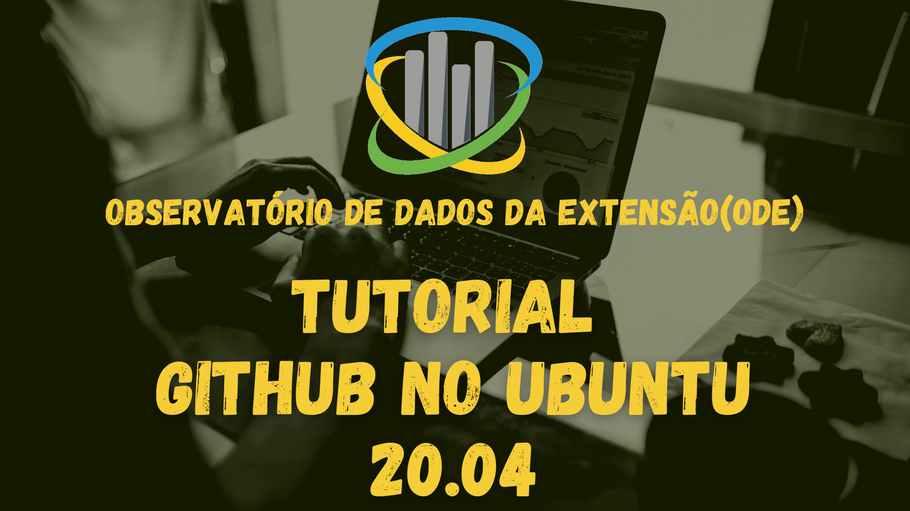

<h1 align="center">Tutorial GitHub</h1>

Nesse material, vamos apresentar as principais ferramentas e conceitos envolvendo o git aplicadas ao GitHub. A confecção desse material teve como base o manual prático do _GitHub_ além da experiência prática dos estudantes.

Para acessar o site oficial do GitHub clique [aqui](https://github.com/)

Para acessar a documentação completa oficial do GitHub clique [aqui](https://docs.github.com/pt)

Para fazer o download do GitHub desktop clique [aqui](https://desktop.github.com/) (tutorial windows)

## Sumário

* ### [Introdução](#intro)

* ### [Commit](#commit)
    
* ### [Branch](#branch-tag)

* ### [Pull request](#pull-link)

* ### [Push](#push-link)

* ### [Vídeos tutoriais no youtube produzidos pelo ODE](#videos)
    * #### [Windows (ou MacOS) - GitHub Desktop](#metodo1)
    * #### [Linux (via Terminal)](#metodo2)
    * #### [Navegador (qualquer sistema)](#metodo3)

* ### [Redes Sociais do ODE](#social-media)

## Introdução ao Git e ao GitHub 

o Git é um sistema de controle de versão desenvolvido para possibilitar o trabalho colaborativo entre programadores, destacando-se por ser simples e rápido. A sua primeira marcante utilzação foi na criação de um kernel linux, uma vez que ele foi criado e projetado por Linus Torvalds(criador do linux). Uma das mais famosas empresas a possibilitar o uso do Git para os usuários é o GitHub, possibilitando a criação de projetos púbicos (qualquer pessoa tem acesso ao conteúdo) ou privados (apenas pessoas autorizadas podem ver). Em uma visão geral, o gitHub é uma plataforma de hospedagem de código-fonte e arquivos com controle de versão usando o Git. Ele permite que programadores, utilitários ou qualquer usuário cadastrado na plataforma contribuam em projetos privados e/ou Open Source de qualquer lugar do mundo. Elex é amplamente utilizado por programadores para divulgação de seus trabalhos ou para que outros programadores contribuam com o projeto, além de promover fácil comunicação através de recursos que relatam problemas ou mesclam repositórios remotos (issues, pull request).

Vale destacaa ainda que existem diversas outras empresas presentes no mercado para utilização do git, como o Bickbucket e o GitLab. Essas empresas basicamente disponibilizam uma pasta na nuvem para que o usuário realize a utilização do git, de forma semelhante ao GitHub. 

#### Vamos conhecer como essa ferramenta funciona?

### Criando um Repositório 
O repositório é o local em que o nosso projeto vai ficar, cabendo a escolha dele ao usuário durante o seu processo de criação. No GitHub, o usário pode escolher também: a privacidade do projeto (público/privado) podendo ser modificada posteriormente; se vai optar por um readme, que é um arquivo markdown(.md) contendo uma descrição do projeto e que vai ser mostrado abaixo das pastas do repositório para situar o repositório; além de outras opções, como o git-ignore - extensões que o github deve ignorar mudanças.

Após a criação do seu repositório, vamos inserir os seus arquivos nele, e isso é feito de maneira intuitiva, simplesmente arrastando os arquivos para a pasta do seu repositório, seja no seu computador(se você clonou um repositório da internet ou está criando um pela primeira vez) ou anexando-os diretamente na pasta da nuvem.

### Commit 
Durante as mudanças nos seus arquivos, você precisa explicar o que está fazendo através dos _commits_,através deles você dá uma descrição das mudanças que vem realizando no seu código de modo a facilitar aos outros participantes do projeto o entendimento do que foi feito.
 

#### *branch 
Um conceito não essencial, mas que é importante é o de _branch_ (traduzido de forma literal para "galho"), que diz respeito ao objetivo das suas mudanças e commits. Imagine, por exemplo, que você está participando de um projeto mas não sabe se o chefe irá aderir aos suas mudanças, sendo assim, pode-se criar uma branch específica para as suas mudanças, de modo que as suas mudanças fiquem separadas da Branch Principal( chamada de _main_) permitindo um trabalho paralelo nas funcionalidades implementadas.  

### pull request 
O pull request é o procedimento imediante anterior ao push (mandar o arquivo para o repositório), durante ele o desenvolvedor pode acompanhar as mudanças que fez e quais arquivos foram modificados, permitindo observar se algum erro foi cometido antes de mandar as moficações para o repositório.

### push (pushing to origin) 
Essa é a etapa final, durante ele o usuário simplesmente manda as suas modificações para o repositório final do projeto. 

## Vídeos tutoriais no youtube produzidos pelo ODE 

### Windows (ou MacOS) - GitHub Desktop 
O GitHub Desktop é um software de computador(desenvolvido com a biblioteca electron em JavaScript) de código aberto, atualmente disponível para Windows e MacOS, cujo objetivo é facilitar e melhorar a experiência de utilização do GitHub, nele é possível ter acesso a todas as etapas necessárias da feramente Git, porém de uma maneira descomplicada e simples de ser utilizada. No vídeo tutorial abaixo, é mostrada a utilização do GitHub de maneira prática no Windows10 (é análogo no MacOS), destacando-se os conceitos anteriormente apresentados e como eles são utilizados no software.  

| [Clique aqui para acessar o vídeo](https://www.youtube.com/watch?v=z0nHNl_YzGw "obrigatorio") |
 

### Linux (via Terminal) 
O protocolo Git surgiu nos sistemas linux, então é natural que nos primórdios a sua utilização fosse exclusivamente feita via terminal, porém apesar de terem surgido formas mais práticas de interagir com o Git como é o caso do GitHub, ainda é amplamente realizada a sua utilização via terminal tendo em vista a facilidade da criação de scripts que realizam o upload de arquivos com apenas um comando (pode-se dizer também é uma forma mais clássica). 

| [Clique aqui para acessar o vídeo](https://www.youtube.com/watch?v=vcjkQaORz1k "obrigatorio") |

### Navegador (qualquer sistema) 
O GitHub pode ser acessado praticamente de qualquer dispostivo com acesso a internet, possibilitando que o usuário faça uploads ou observe commits/mudanças no seu repositório praticamente de qualquer tipo de dispositivo móvel. É importante destacar porém que existe umm limite de upload utilizando-se o GitHub direto do navegador, o que pode ser um problema em projetos maiores, necessitando a atualização via terminal ou no App GitHub Desktop.

| [Clique aqui para acessar o vídeo](https://www.youtube.com/watch?v=OUXHaj6kdb0 "obrigatorio") |

### visite as nossas redes sociais: 

 
 
